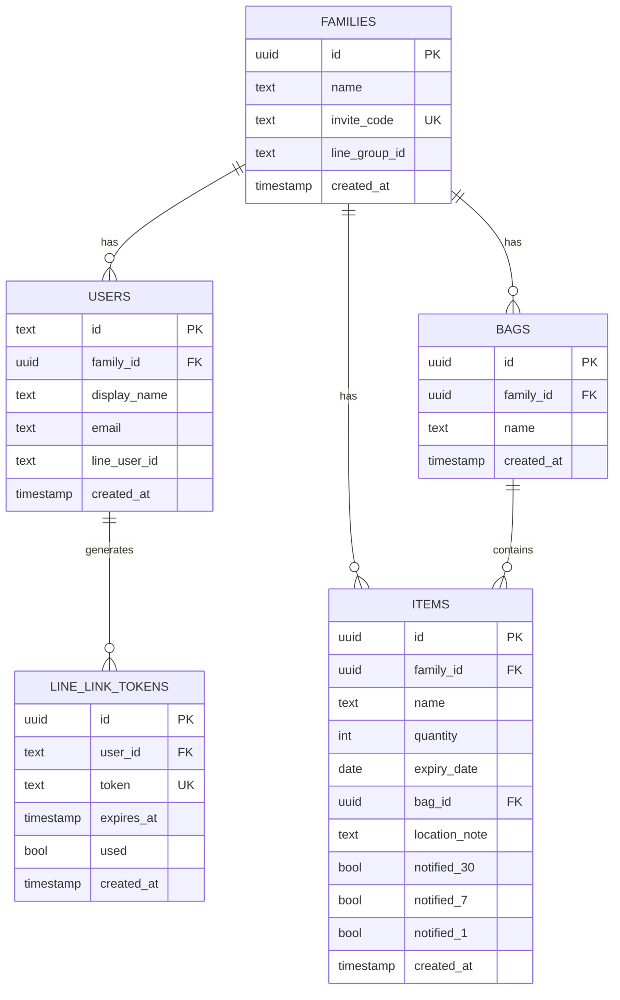

# 📦 stockpile-manager 要件定義書

> **非常袋の備蓄品と賞味期限を管理するWebアプリケーション**
>
---

## 1. プロジェクト概要

### 1.1 背景・目的
災害時に必要な非常袋の中身を適切に管理し、賞味期限切れを防ぐためのWebアプリケーション。家族間でデータを共有し、LINE通知により期限切れを事前に把握できる。

### 1.2 ターゲットユーザー
- 非常袋を保有する一般家庭
- 複数の備蓄拠点を管理する必要のあるユーザー
- 家族間で備蓄品管理を共有したいグループ

---

## 2. 機能要件

### 2.1 ユーザー認証・管理

| 機能ID  | 機能名         | 説明                              | 優先度 |
| ------- | -------------- | --------------------------------- | ------ |
| AUTH-01 | ユーザー登録   | メール/パスワードでのユーザー登録 | 必須   |
| AUTH-02 | ログイン       | Stack Authによる認証              | 必須   |
| AUTH-03 | ゲストログイン | 登録なしでのお試し利用            | 必須   |
| AUTH-04 | ログアウト     | セッション終了                    | 必須   |

### 2.2 家族（グループ）管理

| 機能ID | 機能名               | 説明                                     | 優先度 |
| ------ | -------------------- | ---------------------------------------- | ------ |
| FAM-01 | 家族グループ作成     | 新規グループ作成、6桁招待コード自動生成  | 必須   |
| FAM-02 | 家族グループ参加     | 招待コード入力による既存グループへの参加 | 必須   |
| FAM-03 | 家族メンバー一覧表示 | グループ内メンバーの表示名・メール表示   | 必須   |
| FAM-04 | 家族招待機能         | 招待コードの表示・共有                   | 必須   |

### 2.3 備蓄品管理

| 機能ID  | 機能名                 | 説明                                       | 優先度 |
| ------- | ---------------------- | ------------------------------------------ | ------ |
| ITEM-01 | 備蓄品登録             | 品名、数量、賞味期限、収納場所、メモの入力 | 必須   |
| ITEM-02 | 備蓄品編集             | 登録済みアイテムの情報更新                 | 必須   |
| ITEM-03 | 備蓄品削除             | 単一アイテムの削除                         | 必須   |
| ITEM-04 | 備蓄品一括削除         | 複数選択したアイテムの一括削除             | 必須   |
| ITEM-05 | 備蓄品一覧表示         | 期限順ソートでの一覧表示                   | 必須   |
| ITEM-06 | 期限警告表示           | 期限切れ・期限間近の視覚的アラート         | 必須   |
| ITEM-07 | 収納場所フィルタリング | 収納場所別のアイテム絞り込み               | 必須   |
| ITEM-08 | アイテム選択機能       | 一括操作のためのチェックボックス選択       | 必須   |

### 2.4 OCR機能

| 機能ID | 機能名       | 説明                                                          | 優先度 |
| ------ | ------------ | ------------------------------------------------------------- | ------ |
| OCR-01 | 画像撮影     | カメラでの賞味期限ラベル撮影                                  | 必須   |
| OCR-02 | 画像選択     | ライブラリからの画像選択                                      | 必須   |
| OCR-03 | 画像圧縮     | API制限（1MB）対応の自動圧縮                                  | 必須   |
| OCR-04 | 日付抽出     | OCR.space APIによる日付認識                                   | 必須   |
| OCR-05 | 日付形式対応 | `YYYY-MM-DD`, `YYYY/MM/DD`, `YYYY.MM.DD`, `YYYY年MM月DD日` 等 | 必須   |

### 2.5 収納場所管理

| 機能ID | 機能名       | 説明                                       | 優先度 |
| ------ | ------------ | ------------------------------------------ | ------ |
| BAG-01 | 収納場所作成 | 新規収納場所の登録（例: 玄関用、車載用）   | 必須   |
| BAG-02 | 収納場所削除 | 収納場所の削除（紐づくアイテムは未分類へ） | 必須   |
| BAG-03 | 収納場所一覧 | 登録済み収納場所の表示                     | 必須   |

### 2.6 データインポート

| 機能ID | 機能名         | 説明                                 | 優先度 |
| ------ | -------------- | ------------------------------------ | ------ |
| IMP-01 | JSONインポート | JSON形式での備蓄品データ一括取り込み | 必須   |

### 2.7 LINE通知連携

| 機能ID  | 機能名           | 説明                                       | 優先度 |
| ------- | ---------------- | ------------------------------------------ | ------ |
| LINE-01 | QRコード連携     | QRコードスキャンによるLINEボット友だち追加 | 必須   |
| LINE-02 | 6桁コード認証    | ワンタイムコードによるアカウント紐付け     | 必須   |
| LINE-03 | 個人通知設定     | LINE User ID による個人への通知            | 必須   |
| LINE-04 | グループ通知設定 | LINE Group ID による家族グループへの通知   | 必須   |
| LINE-05 | 自動期限通知     | 30日前、7日前、当日の自動通知              | 必須   |
| LINE-06 | 通知重複防止     | 同一アイテムへの重複通知防止フラグ管理     | 必須   |

---

## 3. 非機能要件

### 3.1 パフォーマンス

| 要件ID  | 項目                 | 要件                                      |
| ------- | -------------------- | ----------------------------------------- |
| PERF-01 | ページ読み込み       | 3秒以内                                   |
| PERF-02 | API応答時間          | Edge Runtime採用による低レイテンシ        |
| PERF-03 | コールドスタート対策 | ダッシュボード統合APIによる一括データ取得 |

### 3.2 可用性

| 要件ID   | 項目     | 要件                                      |
| -------- | -------- | ----------------------------------------- |
| AVAIL-01 | デプロイ | Vercel上でのホスティング                  |
| AVAIL-02 | Cron実行 | Vercel Cron Jobs（UTC 23:00 / JST 08:00） |

### 3.3 セキュリティ

| 要件ID | 項目        | 要件                                 |
| ------ | ----------- | ------------------------------------ |
| SEC-01 | 認証        | Stack Auth による認証管理            |
| SEC-02 | 認可        | 家族ID単位でのデータアクセス制御     |
| SEC-03 | Webhook保護 | LINE Webhook のシークレット検証      |
| SEC-04 | Cron保護    | CRON_SECRET によるエンドポイント保護 |

### 3.4 ユーザビリティ

| 要件ID | 項目           | 要件                                         |
| ------ | -------------- | -------------------------------------------- |
| UX-01  | レスポンシブ   | モバイルファーストデザイン                   |
| UX-02  | 言語           | UI全体日本語対応                             |
| UX-03  | 視覚的アラート | 期限切れ（赤）、期限間近（オレンジ）の色分け |

---

## 4. データモデル

### 4.1 ER図（概念）

### 4.2 テーブル定義

#### families（家族）
| カラム        | 型        | 制約               | 説明                    |
| ------------- | --------- | ------------------ | ----------------------- |
| id            | uuid      | PK, default random | 家族ID                  |
| name          | text      | NOT NULL           | 家族名                  |
| invite_code   | text      | UNIQUE, NOT NULL   | 招待コード（6桁英数字） |
| line_group_id | text      | -                  | LINEグループID          |
| created_at    | timestamp | default now        | 作成日時                |

#### users（ユーザー）
| カラム       | 型        | 制約                                | 説明                     |
| ------------ | --------- | ----------------------------------- | ------------------------ |
| id           | text      | PK                                  | Auth Provider ユーザーID |
| family_id    | uuid      | FK (families.id ON DELETE SET NULL) | 所属家族ID               |
| display_name | text      | -                                   | 表示名                   |
| email        | text      | -                                   | メールアドレス           |
| line_user_id | text      | -                                   | LINE User ID             |
| created_at   | timestamp | default now                         | 作成日時                 |

#### bags（収納場所）
| カラム     | 型        | 制約                                         | 説明       |
| ---------- | --------- | -------------------------------------------- | ---------- |
| id         | uuid      | PK, default random                           | 収納場所ID |
| family_id  | uuid      | FK (families.id ON DELETE CASCADE), NOT NULL | 所属家族ID |
| name       | text      | NOT NULL                                     | 収納場所名 |
| created_at | timestamp | default now                                  | 作成日時   |

#### items（備蓄品）
| カラム        | 型        | 制約                                         | 説明               |
| ------------- | --------- | -------------------------------------------- | ------------------ |
| id            | uuid      | PK, default random                           | アイテムID         |
| family_id     | uuid      | FK (families.id ON DELETE CASCADE), NOT NULL | 所属家族ID         |
| name          | text      | NOT NULL                                     | 品名               |
| quantity      | int       | default 1                                    | 数量               |
| expiry_date   | date      | -                                            | 賞味期限           |
| bag_id        | uuid      | FK (bags.id ON DELETE SET NULL)              | 収納場所ID         |
| location_note | text      | -                                            | 場所メモ           |
| notified_30   | bool      | default false                                | 30日前通知済フラグ |
| notified_7    | bool      | default false                                | 7日前通知済フラグ  |
| notified_1    | bool      | default false                                | 当日通知済フラグ   |
| created_at    | timestamp | default now                                  | 作成日時           |

#### line_link_tokens（LINE連携トークン）
| カラム     | 型        | 制約                                      | 説明          |
| ---------- | --------- | ----------------------------------------- | ------------- |
| id         | uuid      | PK, default random                        | トークンID    |
| user_id    | text      | FK (users.id ON DELETE CASCADE), NOT NULL | 発行者ID      |
| token      | text      | UNIQUE, NOT NULL                          | 6桁認証コード |
| expires_at | timestamp | NOT NULL                                  | 有効期限      |
| used       | bool      | default false                             | 使用済フラグ  |
| created_at | timestamp | default now                               | 作成日時      |

---

## 5. API仕様

### 5.1 エンドポイント一覧

| メソッド | パス                 | 説明                         |
| -------- | -------------------- | ---------------------------- |
| GET      | `/api/dashboard`     | ダッシュボードデータ一括取得 |
| GET      | `/api/items`         | 備蓄品一覧取得               |
| POST     | `/api/items`         | 備蓄品登録                   |
| PUT      | `/api/items`         | 備蓄品更新                   |
| DELETE   | `/api/items?id={id}` | 備蓄品削除                   |
| POST     | `/api/items/import`  | 備蓄品一括インポート         |
| GET      | `/api/bags`          | 収納場所一覧取得             |
| POST     | `/api/bags`          | 収納場所登録                 |
| DELETE   | `/api/bags?id={id}`  | 収納場所削除                 |
| GET      | `/api/family`        | 家族情報取得                 |
| POST     | `/api/family`        | 家族作成/参加                |
| PUT      | `/api/family`        | 家族情報更新                 |
| GET      | `/api/user`          | ユーザー情報取得             |
| PUT      | `/api/user`          | ユーザー情報更新             |
| POST     | `/api/ocr`           | 画像OCR処理                  |
| GET      | `/api/line/link`     | LINE連携状態確認             |
| POST     | `/api/line/link`     | LINE連携コード発行           |
| POST     | `/api/webhook/line`  | LINE Webhook受信             |
| GET      | `/api/cron/notify`   | 期限通知Cron実行             |

---

## 6. 技術スタック

### 6.1 フロントエンド
| 分類           | 技術           |
| -------------- | -------------- |
| フレームワーク | Next.js 16.1   |
| UIライブラリ   | React 19.2     |
| 言語           | TypeScript     |
| スタイリング   | Tailwind CSS 4 |
| QRコード       | qrcode.react   |

### 6.2 バックエンド
| 分類         | 技術                           |
| ------------ | ------------------------------ |
| ランタイム   | Vercel Edge Runtime            |
| 認証         | Stack Auth (@stackframe/stack) |
| ORM          | Drizzle ORM                    |
| データベース | Neon (PostgreSQL)              |

### 6.3 外部サービス
| 分類     | サービス           |
| -------- | ------------------ |
| OCR      | OCR.space API      |
| 通知     | LINE Messaging API |
| デプロイ | Vercel             |
| Cron     | Vercel Cron Jobs   |

---

## 7. 画面構成

| 画面ID | 画面名               | 概要                                 |
| ------ | -------------------- | ------------------------------------ |
| SCR-01 | ログイン画面         | Stack Auth認証フォーム               |
| SCR-02 | 家族セットアップ     | 新規作成 or 招待コード入力           |
| SCR-03 | ダッシュボード       | 備蓄品一覧、フィルタ、各種設定ボタン |
| MOD-01 | アイテム登録モーダル | 品名、期限、OCR、収納場所入力        |
| MOD-02 | アイテム編集モーダル | 既存アイテムの編集                   |
| MOD-03 | インポートモーダル   | JSONファイル取り込み                 |
| MOD-04 | LINE設定モーダル     | QRコード連携、手動ID入力             |
| MOD-05 | 家族招待モーダル     | 招待コード表示                       |
| MOD-06 | 確認モーダル         | 削除確認ダイアログ                   |

---

## 8. 制約・前提条件

### 8.1 対象ブラウザ
- Chrome（最新版）
- Firefox（最新版）
- Safari（最新版）
- Edge（最新版）

### 8.2 制限事項
- オフライン動作：非対応
- 画像アップロード：最大1MB（自動圧縮対応）
- LINE通知：日本時間 午前8時に1日1回実行

---

## 9. 用語集

| 用語            | 定義                                       |
| --------------- | ------------------------------------------ |
| 家族            | 備蓄品を共有するグループ単位               |
| 収納場所（Bag） | 物理的な収納場所（非常袋、車載ボックス等） |
| 招待コード      | 6桁英数字の家族参加用コード                |
| 連携コード      | LINE連携用の6桁ワンタイムパスワード        |

---

## 更新履歴

| 日付       | バージョン | 内容     |
| ---------- | ---------- | -------- |
| 2026-02-07 | 1.0        | 初版作成 |
